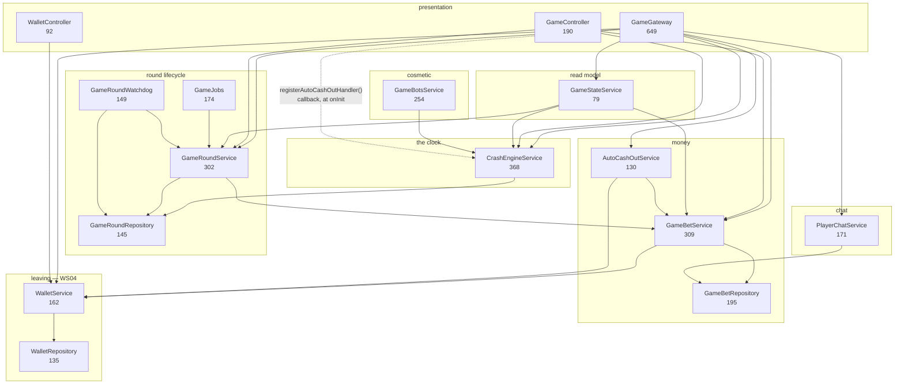

# 02 — Game module decomposition

Workstream 02. Branch `refactor/architecture-sweep`. Read against
`apps/be/src/game` at 26 files / 4823 lines.

The ask, as given: *"Game module — a lot of classes can be joined together and the
game module itself needs to be split in different modules so it's not a monolith
module."*

**Half of that ask is wrong and the other half is right.** Of the four merge
candidates named, three are no-merges and the fourth wants *more* separation, not
less — see §2. The split is right, and it buys something better than tidiness:
it turns three invariants that are currently comments into boot errors. §3.

---

## 1. The dependency graph as it actually is

### 1.1 Injection edges

Ambient bindings — omitted from the diagram because they are in every scope
already — are `SyncDatabase`, `RedisConnection`, `AppConfigService`, `Logger`,
`EventsPublisher`, `JobPublisher`, `ScheduleRegistry`, `PubSub`, `Auth`,
`CurrentUser`, `AIService`, `ChatService`. Of these, `EventsPublisherModule`,
`QueuesModule`, `SchedulesModule`, `RedisCacheModule` and `AIModule` are already
`global: true`; `AccountsModule` and `ChatModule` are decorated classes the game
module imports.

| Class | File | Lines | Injects (game-internal in bold) |
|---|---|---|---|
| `GameRoundRepository` | `repos/game-round.repository.ts` | 145 | `SyncDatabase` |
| `GameBetRepository` | `repos/game-bet.repository.ts` | 195 | `SyncDatabase` |
| `WalletRepository` | `repos/wallet.repository.ts` | 135 | `SyncDatabase` |
| `WalletService` | `services/wallet.service.ts` | 162 | **`WalletRepository`**, config, logger |
| `GameBetService` | `services/game-bet.service.ts` | 309 | **`GameBetRepository`**, **`WalletService`**, `SyncDatabase`, config, logger |
| `GameRoundService` | `services/game-round.service.ts` | 302 | **`GameRoundRepository`**, **`GameBetService`**, `SyncDatabase`, redis, config, logger |
| `CrashEngineService` | `engine/crash-engine.service.ts` | 368 | **`GameRoundRepository`**, jobs, redis, events, schedules, config, logger |
| `GameJobs` | `handlers/game.jobs.ts` | 174 | **`GameRoundService`**, jobs, redis, events, config, logger |
| `AutoCashOutService` | `services/auto-cashout.service.ts` | 130 | **`GameBetService`**, **`WalletService`**, redis, events, logger |
| `GameStateService` | `services/game-state.service.ts` | 79 | **`CrashEngineService`**, **`GameRoundService`**, **`GameBetService`** |
| `GameRoundWatchdog` | `services/game-watchdog.service.ts` | 149 | **`GameRoundService`**, **`GameRoundRepository`**, jobs, events, schedules, config, logger |
| `PlayerChatService` | `services/player-chat.service.ts` | 171 | **`GameBetRepository`**, redis, events, logger |
| `GameBotsService` | `bots/game-bots.service.ts` | 254 | **`CrashEngineService`**, events, `AIService`, `ChatService`, config, logger |
| `GameGateway` | `game.gateway.ts` | 649 | `Auth`, **`CrashEngineService`**, **`GameRoundService`**, **`GameBetService`**, **`WalletService`**, **`AutoCashOutService`**, **`GameStateService`**, **`PlayerChatService`**, `ChatService`, redis, events, `PubSub`, config, logger — **14** |
| `GameController` | `game.controller.ts` | 190 | **`GameRoundService`**, **`GameBetService`**, **`CrashEngineService`**, `CurrentUser` |
| `WalletController` | `wallet.controller.ts` | 92 | **`WalletService`**, `CurrentUser` |

Not injectable, no container behind them: `game.math.ts` (`GameMath`),
`game.messages.ts` (`GameMessages`), `game.events.ts` (`GameEvents`),
`dto/game.dto.ts`, the three `schema/*.ts`, and the two test files.



### 1.2 Four facts the graph makes visible

**a. There is no dependency cycle, and the module comment says there is.**
`game.module.ts` lines 45–50 claim `GameBetService` and `GameRoundService`
"reference each other" and that Nest needed `forwardRef()` on both sides. At
runtime they do not: `GameBetService`'s constructor names
`GameBetRepository`, `WalletService`, `SyncDatabase`, config and logger — no
round service. The only backwards edge is
`import type { RefundedBet } from './game-round.service.js'`, a **type-only
import that erases at build time**. The graph is a DAG. That comment is the main
reason this module reads as un-splittable, and it is wrong. Fix: move the
`RefundedBet` interface onto `GameBetService`, which is the function that returns
it, and delete the paragraph.

**b. The engine is already a near-leaf.** `CrashEngineService` injects
`GameRoundRepository` and nothing else from the game. It has no path to
`GameBetService`, `WalletService` or any publisher of a bet frame. That is what
makes "exactly one clock" cheap to protect — and what makes the two proposed
merges into it (§2) expensive.

**c. Nothing outside the module consumes `GameModule`'s exports.**
`exports: [GameRoundService, GameBetService, WalletService]` has exactly one
importer — `AppModule` — which declares no provider that injects any of them.
Only `app.module.ts` and `infra/db/schema.ts` reference anything under
`game/` at all. The module is already well-encapsulated externally; the problem
is entirely internal.

**d. The gateway's `onInit` callback wiring is stale scaffolding.**
`GameGateway.onInit` calls `engine.registerAutoCashOutHandler(...)` and its
doc comment justifies it with `GameModule.forRoot({ engine: false })` — a factory
that no longer exists (the module is decorated now, and says so 20 lines above).
Meanwhile `CrashEngineService`'s own class comment says "The tick emitter is
gone… neither callback is needed." Both comments cannot be right. The callback
itself is worth keeping (see Risk 4); the comments are not.

### 1.3 Dead code found while reading

Every one of these has zero callers. Verified by grep across `src` and `e2e`.

| Dead | File | Lines | Note |
|---|---|---|---|
| `parseBet`, `parseSeed`, `parseChat`, `playerFacing` (free functions) | `game.messages.ts:9–61` | 53 | Byte-for-byte duplicates of the `GameMessages` statics below them. The gateway calls only `GameMessages.*`. |
| `playerChatTopic` (free function) | `game.events.ts:57–58` | 2 | Duplicate of `GameEvents.playerChatTopic`, which is what the three callers use. |
| `AutoCashOut` interface | `engine/crash-engine.service.ts:39–45` | 7 | The real shape is `Pending`, private to `auto-cashout.service.ts`. |
| `GameGateway.spectators` getter | `game.gateway.ts:645–648` | 4 | |
| `GameBetService.recentByUser` + `GameBetRepository.recentByUser` | both | 12 | The service method has no caller, so the repository method it wraps is unreachable too. |
| `WalletService.getBalanceCents` | `services/wallet.service.ts:49–51` | 3 | |
| `WalletService.scoped` | `services/wallet.service.ts:158–161` | 4 | **Keep this one** — step 6 uses it as the wallet seam. |
| `RoundVerification` interface | `services/game-round.service.ts:293–302` | 10 | Duplicates the zod `RoundVerification` in `dto/game.dto.ts`; `GameController.verify` re-spreads it field by field. |
| `GameMath.fromMultiplier` | `game.math.ts:30–32` | 3 | Only its own test calls it. Keep — it is the round-trip assertion's other half. |
| `GameModule.exports` | `game.module.ts:62` | 1 | See §1.2c. |

~100 lines, deletable in one commit that changes no behaviour.

### 1.4 Duplication found while reading

- **The round→wire projection exists three times.** `GameStateService.snapshot`
  (`recentCrashes`, `activeBets`), `GameController.#mapRound` and
  `GameController.#mapBet` all do the same `crashPointX100 === null ? {} : {
  crashPoint: GameMath.toMultiplier(...) }` and `cashedOutAtX100` dance with
  `exactOptionalPropertyTypes` spreads. Three copies of the rule "the seed and
  the crash point are absent until the round has crashed" — which the controller's
  own comment calls "the fairness guarantee expressed in one place".
- **The client-seed Redis hash is manipulated from four files.**
  `GameRoundService.clientSeedsKey` is a `static` reached by `game.gateway.ts`
  (twice: `HSETNX` in `#placeBet`, `hset`+`expire` in `#submitSeed`),
  `handlers/game.jobs.ts` (`del`) and `game-round.service.ts` itself
  (`hgetall`). Four files, raw Redis verbs, one lifecycle — and that lifecycle
  *is* the fairness ordering.
- **The seed/fairness logic is split across two files by accident.**
  `GameMath` holds `fairnessSeed` + `crashPointX100` + `DEFAULT_RNG_ALGORITHM`;
  `GameRoundService` holds `generateSeed`, `generateSeedHash`,
  `combineClientSeeds`, `autoClientSeed`. The dividing line is "does it need a
  container" — and none of these do except `nextNonce`.

---

## 2. Merge verdicts

| Classes | Verdict | Reason |
|---|---|---|
| `GameStateService` (79) → `GameRoundService` (302) | **No** | Inverts the dependency direction. `GameRoundService` is what `GameJobs` injects and it currently has **no path to `CrashEngineService`**; `GameStateService` injects the engine. Merging gives every queue handler a transitive edge to the clock, which is the exact coupling `JobsModule` exists to prevent. It would also make the round service 380 lines straddling "lifecycle writes" and "lobby read model". |
| `AutoCashOutService` (130) → `GameBetService` (309) | **No** | 439 lines, and it puts `RedisConnection`, `EventsPublisher` and an `await` loop into the one class whose entire correctness argument is *"`transactionSync` cannot yield — an async callback is a type error"*. The two are on opposite sides of that line: `GameBetService` is synchronous transactional money, `AutoCashOutService` is an async Redis sweep that publishes. It would also drag the publisher into `GameRoundService`→`GameJobs`, widening the job path's surface for nothing. |
| `GameRoundWatchdog` (149) → `CrashEngineService` (368) | **No** | 517 lines, over the 500-line `max-lines` cap, and it gives the clock a transitive dependency on the wallet: the watchdog injects `GameRoundService` → `GameBetService` → `WalletService` → `WalletRepository`. The engine is deliberately a near-leaf on `GameRoundRepository` alone. They also differ in kind: the engine is an in-memory clock that publishes ticks; the watchdog is a scheduled sweep that writes, refunds and re-enqueues. The only thing they share is `ScheduleRegistry`, which is global. |
| `game.math.ts` ↔ the fairness/seed logic | **Split further, not merge** | The right cut is not "join them" — it is to move the *fairness* half out of both. New pure `fairness/fairness.ts` holds `serverSeed()` (CSPRNG), `commit(seed)`, `combine(seeds)`, `autoClientSeed()`, `seedString()`, `crashPointX100()` and `DEFAULT_RNG_ALGORITHM` — every input a player re-runs, in one file, unit-testable with no container. `game.math.ts` keeps only the curve (`multiplierAtX100`) and the money (`payoutCents`, `toMultiplier`, `fromMultiplier`) and drops to ~60 lines. `GameRoundService` drops to ~200 and stops being where the CSPRNG lives. |

### 2.1 Merges that *are* worth doing (not in the ask)

| Classes | Verdict | Merged responsibility |
|---|---|---|
| `game.messages.ts` free functions → the `GameMessages` class | **Yes — delete, not merge** | Already duplicates. |
| `GameStateService` + `GameController.#mapRound`/`#mapBet` → new pure `game.view.ts` | **Yes** | *"One place that decides what a round row looks like on the wire, including the rule that the seed and the crash point are absent until it has crashed."* Pure statics, no provider. `GameStateService` keeps its container-shaped part (it needs the engine) and drops to ~45 lines. |
| The four client-seed call sites → new `ClientSeedService` | **Yes** | *"Owns the per-round client-seed pool in Redis, from a player's contribution to the combined value the draw consumes to the discard after the launch — and the nonce."* Four files stop naming a Redis key; the ordering that is the fairness guarantee becomes readable in one class. |
| `GameGateway`'s `#placeBet`/`#cashOut` bodies → new `BetActionsService` | **Yes** | *"What placing a bet and cashing out mean: the phase gate, the debit, the entropy contribution, the auto-cashout registration, and the two frames each publishes."* 165 lines out of the gateway. This is the one extraction that must land with a test — see step 5. |
| `GameGateway`'s upgrade → new `SocketAuthService` | **Yes** | *"Who is on the far end of a socket, including the `?token=` fallback and why it exists."* 60 lines out of the gateway, and the security comment gets a file of its own. |

### 2.2 The honest summary of §2

Three of the four named candidates are no-merges, and all three fail for the same
reason: **the classes in `game/services` are small because the coupling between
them is real and directional.** Each proposed merge crosses a boundary this
codebase documents as load-bearing — synchronous money vs asynchronous
publishing, the clock vs the wallet, the read model vs the lifecycle — and each
produces a 380–520 line class that straddles it.

What *is* joinable is duplication, not classes: three copies of the round
projection, two copies of every inbound parser, four files touching one Redis
hash. Those are the merges in §2.1, and they remove more lines than any of the
merges in the ask would have.

---

## 3. The proposed module layout

Six sub-modules and a facade. **Every one is `@Module`-decorated with no static
factory.** That is not a style choice — see §4.

```
apps/be/src/game/
├── game.module.ts                    facade. @Module, imports the six, exports nothing
├── game.events.ts                    GAME_QUEUE, GAME_JOBS, RoundJob, GameEvents.publish
├── game.math.ts                      the curve + the payout only            (113 → ~60)
├── game.math.test.ts                 (130 → ~90; the fairness half moves out)
├── game.spec.ts                      unchanged assertions, new import paths
│
├── engine/                           GameEngineModule — the clock
│   ├── engine.module.ts              NEW
│   ├── crash-engine.service.ts       (368 → ~320)
│   └── engine.commands.ts            NEW: GAME_ENGINE_CHANNEL + EngineCommand
│
├── fairness/                         GameFairnessModule — the provable-RNG boundary
│   ├── fairness.module.ts            NEW
│   ├── fairness.ts                   NEW, pure: server seed, commitment, combine,
│   │                                 autoClientSeed, seedString, crashPointX100
│   ├── fairness.test.ts              NEW (from game.math.test.ts)
│   └── client-seed.service.ts        NEW: the Redis pool + the nonce
│
├── rounds/                           GameRoundsModule — the lifecycle
│   ├── rounds.module.ts              NEW
│   ├── game-round.service.ts         (302 → ~200)
│   ├── game-round.repository.ts      unchanged
│   ├── game-round.schema.ts          moved from schema/
│   ├── round.jobs.ts                 moved from handlers/game.jobs.ts
│   └── round-watchdog.service.ts     moved from services/game-watchdog.service.ts
│
├── betting/                          GameBettingModule — the money
│   ├── betting.module.ts             NEW
│   ├── game-bet.service.ts           (309 → ~300; gains RefundedBet, loses recentByUser)
│   ├── game-bet.repository.ts        (195 → ~180)
│   ├── game-bet.schema.ts            moved from schema/
│   └── auto-cashout.service.ts       moved from services/
│
├── bots/                             GameBotsModule — cosmetic
│   ├── bots.module.ts                NEW
│   └── game-bots.service.ts          unchanged
│
└── surface/                          GameSurfaceModule — the one socket, the routes
    ├── surface.module.ts             NEW
    ├── game.gateway.ts               (649 → ~300)
    ├── socket-auth.service.ts        NEW: @OnUpgrade body + #authHeaders
    ├── bet-actions.service.ts        NEW: #placeBet + #cashOut bodies
    ├── bet-actions.test.ts           NEW
    ├── game-state.service.ts         (79 → ~45; gains connectFrames())
    ├── game.view.ts                  NEW, pure: row → wire projections
    ├── game.messages.ts              (179 → ~120)
    ├── game.controller.ts            (190 → ~120)
    └── game.dto.ts                   moved from dto/game.dto.ts, wallet half removed
```

### Where all 26 current files end up

| # | Current file | Destination |
|---|---|---|
| 1 | `bots/game-bots.service.ts` | `bots/game-bots.service.ts` (unchanged) |
| 2 | `dto/game.dto.ts` | **split**: game half → `surface/game.dto.ts`; `Wallet`, `WalletTransaction`, `PaginatedTransactions`, `DemoQuery`, `walletQuery`, `listTransactions` → `wallet/dto/wallet.dto.ts` (**WS04**) |
| 3 | `engine/crash-engine.service.ts` | `engine/crash-engine.service.ts`; `EngineCommand` + `GAME_ENGINE_CHANNEL` → `engine/engine.commands.ts`; dead `AutoCashOut` deleted |
| 4 | `game.controller.ts` | `surface/game.controller.ts`; `#mapRound`/`#mapBet` → `surface/game.view.ts` |
| 5 | `game.events.ts` | stays at `game/game.events.ts`; free `playerChatTopic` deleted; `GameEvents.playerChatTopic` → `chat/chat.topics.ts` (step 7) |
| 6 | `game.gateway.ts` | `surface/game.gateway.ts` |
| 7 | `game.math.test.ts` | stays; fairness assertions → `fairness/fairness.test.ts` |
| 8 | `game.math.ts` | stays; `fairnessSeed`, `crashPointX100`, `DEFAULT_RNG_ALGORITHM` → `fairness/fairness.ts` |
| 9 | `game.messages.ts` | `surface/game.messages.ts`; five dead free exports deleted; chat parsers → `chat/chat.messages.ts` (step 7) |
| 10 | `game.module.ts` | `game/game.module.ts`, now the facade |
| 11 | `game.spec.ts` | stays at `game/game.spec.ts` |
| 12 | `handlers/game.jobs.ts` | `rounds/round.jobs.ts` |
| 13 | `repos/game-bet.repository.ts` | `betting/game-bet.repository.ts`; `playerNameFor` → chat (step 7) |
| 14 | `repos/game-round.repository.ts` | `rounds/game-round.repository.ts` |
| 15 | `repos/wallet.repository.ts` | `wallet/wallet.repository.ts` (**WS04**) |
| 16 | `schema/game-bet.schema.ts` | `betting/game-bet.schema.ts` |
| 17 | `schema/game-round.schema.ts` | `rounds/game-round.schema.ts` |
| 18 | `schema/wallet.schema.ts` | `wallet/wallet.schema.ts` (**WS04**) |
| 19 | `services/auto-cashout.service.ts` | `betting/auto-cashout.service.ts` |
| 20 | `services/game-bet.service.ts` | `betting/game-bet.service.ts` |
| 21 | `services/game-round.service.ts` | `rounds/game-round.service.ts` |
| 22 | `services/game-state.service.ts` | `surface/game-state.service.ts` |
| 23 | `services/game-watchdog.service.ts` | `rounds/round-watchdog.service.ts` |
| 24 | `services/player-chat.service.ts` | `src/chat/services/player-chat.service.ts` (step 7; fallback: `surface/`) |
| 25 | `services/wallet.service.ts` | `wallet/wallet.service.ts` (**WS04**) |
| 26 | `wallet.controller.ts` | `wallet/wallet.controller.ts` (**WS04**) |

### The six modules, declared

| Module | Decorated or configured | Provides | Exports | Imports |
|---|---|---|---|---|
| `GameFairnessModule` | **`@Module`** — nothing to vary | `ClientSeedService` | `ClientSeedService` | none (`RedisConnection`, config, `Logger` are global) |
| `GameBettingModule` | **`@Module`** | `GameBetRepository`, `GameBetService`, `AutoCashOutService` | all three | `WalletModule` (WS04) |
| `GameRoundsModule` | **`@Module`** | `GameRoundRepository`, `GameRoundService`, `RoundJobs`, `RoundWatchdogService` | `GameRoundRepository`, `GameRoundService` | `GameBettingModule`, `GameFairnessModule` |
| `GameEngineModule` | **`@Module`** — and this is the one where it matters | `CrashEngineService` | `CrashEngineService` | `GameRoundsModule` |
| `GameBotsModule` | **`@Module`** | `GameBotsService` | nothing | `GameEngineModule`, `ChatModule` |
| `GameSurfaceModule` | **`@Module`** | `GameGateway`, `SocketAuthService`, `BetActionsService`, `GameStateService`; controllers: `GameController` | nothing | `GameEngineModule`, `GameRoundsModule`, `GameBettingModule`, `GameFairnessModule`, `AccountsModule`, `ChatModule`, `WalletModule` (WS04) |
| `GameModule` (facade) | **`@Module`** | nothing | nothing (§1.2c) | the six above |

`RoundJobs` and `RoundWatchdogService` are **not exported**: nothing injects
them. BullMQ finds `@JobHandler` by walking `collectModules(root)` over the whole
graph and resolving through `app.get`, so a private job handler in a nested module
is discovered exactly as it is today. `game.spec.ts` reaches
`GameRoundWatchdog` the same way — `app.get` without a `from` falls back to *"any
single scope that declares the token"*, so **the spec needs no export and no
change beyond import paths.** The corollary is a hard rule: a provider class must
appear in exactly one `providers` array in the whole graph, or `app.get` becomes
ambiguous.

### What the split buys, beyond fewer providers per module

**Bots become cosmetic by construction rather than by comment.**
`GameBotsModule` imports `GameEngineModule` (which exports only
`CrashEngineService`) and `ChatModule`. `GameBetService`, `GameBetRepository`,
`WalletService` and `ClientSeedService` are **not visible in its scope at all**.
A future `GameBotsService` constructor that names one does not place a bet — it
fails to boot, with dunx's `unresolvableMessage` naming the module that declares
it and the import that is missing. Today the same mistake compiles and runs, and
the only thing stopping it is a paragraph in a doc comment. This is the single
biggest win of the split, and it is worth the seven new files on its own.

**The fairness boundary becomes a module boundary.** Everything a player re-runs
to check us lives under `fairness/`, with one pure file and one Redis-backed
service. The ordering constraint stops being spread over four files.

**The clock's blast radius is legible.** `GameEngineModule` exports one class and
imports one module. Anything that wants the clock says so in its `imports`.

### How the 649-line gateway shrinks under "one gateway, one connection"

`@Gateway('/ws')` is mounted as a route, and two gateway classes on one path is a
boot error. So there is exactly one legal move: **the class keeps every `@OnX`
handler and delegates the body.** Concretely:

| Piece | Now | After | Where the code goes |
|---|---|---|---|
| `#authHeaders` + `@OnUpgrade upgrade` + its 47-line comment | 63 | ~4 | `surface/socket-auth.service.ts` |
| `@OnOpen opened` | 61 | ~18 | four `socket.send`s become a loop over `GameStateService.connectFrames(player)`; the `socket.subscribe` calls **stay** — subscription is per-socket |
| `#placeBet` | 83 | 0 | `BetActionsService.place()` |
| `#cashOut` | 82 | 0 | `BetActionsService.cashOut()` |
| `#submitSeed` | 31 | ~5 | `ClientSeedService.contribute()` |
| `joinPlayerChat` participant fan-out + `announce` | 53 | ~20 | `PlayerChatService.joined()`; `socket.subscribe` stays |
| `globalChat` line construction + publish + record | 33 | ~10 | `ChatService.say(player, text)` |
| `onInit` callback wiring | 21 | ~10 | stays, comment corrected (Risk 4) |
| `spectators` getter | 4 | 0 | dead |
| imports | 38 | ~23 | |
| `oxlint-disable max-lines` header | 6 | 0 | |

**649 → ~300**, comfortably under the 500-line `max-lines` cap, so the
`oxlint-disable` at the top comes off — which is the real test of whether this
worked. Constructor: 14 deps → 8 (`SocketAuthService`, `BetActionsService`,
`GameStateService`, `ClientSeedService`, `PlayerChatService`, `ChatService`,
`PubSub`, `EventsPublisher`, `Logger`) — the engine, both repositories'
services, and `WalletService` all leave.

**Rejected alternative, for the record:** dunx's `discoverGateway` calls
`markedMethods` over the **prototype chain**, so `class GameGateway extends
ChatHandlers` with `@OnMessage` on the base *would* work and *would* keep one
path and one connection. Reject it anyway: `@dunx/transform` records the
**concrete** class's constructor parameter types, so every dependency still has
to be listed on `GameGateway` and threaded through `super(...)`. Inheritance
moves the lines and keeps the coupling, which is backwards.

---

## 4. Shared-binding hazard list

This is the part of a dunx split that goes wrong, so it gets its own section.

**The headline: no new `global: true` module is needed, and none should be
added.** The reason is specific to how dunx keys scopes, and it is worth stating
because the rule as usually quoted ("`forRoot()` twice means two instances")
gets over-generalised into "shared bindings need `global: true`":

- `collectModules` dedupes a **decorated class** by reference (`seenClasses`), so
  the same `@Module` class imported by five modules is resolved **once**, into
  one scope, with one instance per binding.
- `buildScopes` treats two import paths carrying the *same binding object* as a
  diamond and **stays silent** — the code comment says so explicitly: *"Two
  imports exporting the same binding is a diamond… and has one answer, so it must
  stay silent."*
- `forRoot()` returns a **new object per call**, and scopes are keyed on the
  module reference. *That* is what produces two scopes and two instances.

So: **as long as every game sub-module is `@Module`-decorated with no static
factory, sharing is free.** `global: true` is the escape hatch for a binding whose
owner *must* be configured — which is exactly why `EventsPublisherModule` exists
(its `publisher: 'socket' | 'relay'` genuinely varies between `AppModule` and
`JobsModule`). Nothing in the game varies.

| Binding | Owner after the split | Needed by | Resolution | Hazard if done wrong |
|---|---|---|---|---|
| **`CrashEngineService`** | `GameEngineModule` (decorated) | `GameSurfaceModule`, `GameBotsModule` | both import `GameEngineModule` → one scope, one engine | **Two clocks.** Two engines each tick their own multiplier and each enqueue their own crash job; a client sees the number stutter between two timelines. Occurs if `GameEngineModule` ever gains a `static forRoot()`, or if the engine is declared in two `providers` arrays. Guarded by the identity assertion in step 6. |
| `GameRoundService` | `GameRoundsModule` | `GameSurfaceModule` (gateway, controller, state), `RoundJobs`, `RoundWatchdogService` | exported; jobs and watchdog live in the same module | Two round services means two loggers and two Redis handles — harmless in itself, but it hides the real problem, which is that somebody configured a module that had nothing to configure. |
| `GameRoundRepository` | `GameRoundsModule` | `GameEngineModule`, `RoundWatchdogService`, `game.spec.ts` | exported | none — repositories are stateless over `SyncDatabase` |
| `GameBetService` | `GameBettingModule` | `GameRoundsModule` (`settleCrash`, `failAndRefund` call it inside the caller's transaction), `GameSurfaceModule` | exported; **`GameRoundsModule` imports `GameBettingModule`, never the reverse** | If betting ever imports rounds you get a module-import cycle. dunx survives it (`exportSets` iterates to a fixed point) but it destroys the argument that bots cannot reach the money. |
| `GameBetRepository` | `GameBettingModule` | `PlayerChatService` (`playerNameFor`) | exported — **or, better, step 7 removes this edge entirely** | A DM service reaching into the bet repository for a display name is the one genuinely wrong edge in the current graph. |
| `ClientSeedService` | `GameFairnessModule` | `GameRoundsModule` (collect + draw at launch), `RoundJobs` (discard after launch), `GameSurfaceModule` (a player's contribution) | exported | **Two client-seed services is two nonce counters.** They both `INCR` the same Redis key so the value stays monotonic, but it is the clearest example of why `forRoot()` is banned here. |
| **`WalletService`** (+ `WalletRepository`) | `WalletModule`, **WS04** | `GameBettingModule` (`GameBetService`, `AutoCashOutService`), `GameSurfaceModule` (the demo-wallet connect frame) | **WS04 must make `WalletModule` a decorated class**, and must export `WalletRepository` as well as `WalletService` — `GameBetService.placeBet` and `refundBetsForRound` call `WalletRepository.over(tx)` **directly**. The alternative, and the better one: switch those to `this.wallets.scoped(tx)`, which already exists on `WalletService` and currently has no caller. | A configured `WalletModule.forRoot()` imported by both betting and surface = **two wallet services**. They share one SQLite file so balances stay correct, but this is money and the graph should not be ambiguous about it. Flag to WS04. |
| `ChatService` | `ChatModule` (already decorated) | `GameSurfaceModule`, `GameBotsModule` | both import `ChatModule` — already correct today | none |
| `EventsPublisher` | `EventsPublisherModule` (`global: true`) | engine, round jobs, watchdog, auto-cashout, bots, surface — **six of the seven modules** | **Nothing to do and nothing to import.** Do not add it to any sub-module's `imports` and do not re-provide it anywhere. | Importing `EventsPublisherModule.forRoot()` from a sub-module binds a second publisher. This is the trap the module's own doc comment documents. |
| `AIService` | `AIModule` (`global: true`) | bots | nothing to do | as above |
| `ScheduleRegistry` | `SchedulesModule` (`global: true`) | engine (the per-round tick), watchdog (the sweep), bots (`@Interval`) | nothing to do | a second `ScheduleRegistry` means two copies of every schedule |
| `JobPublisher` | `QueuesModule` (`global: true`) | engine, round jobs, watchdog | nothing to do | — |
| `SyncDatabase`, `RedisConnection`, `AppConfigService`, `Logger`, `PubSub`, `Auth`, `CurrentUser` | global / `AccountsModule` | everywhere | nothing to do | — |

### Two invariants to write into the facade's doc comment

1. **No game sub-module carries `global: true`.** If one did, and somebody later
   added it to `Foundation.for()`, `JobsModule` would build it — and if that
   module were `GameEngineModule`, or anything that transitively imports it, every
   BullMQ fork would be a second clock. `JobsModule` currently imports nothing
   from `game/`, and that must stay true.
2. **No game sub-module carries a `static forRoot()`.** There is nothing to
   configure. The only thing a factory would buy is per-caller configuration,
   which is precisely the mechanism that produces two engines.

---

## 5. Implementation plan

Seven steps. Each ends with `bun run typecheck` and `bun run test` green, and
each is one commit. `nodenext` module resolution means an extensionless or
wrong-depth relative import is a **typecheck** error, not a runtime surprise —
which is what makes the mechanical move in step 6 safe to do as one commit.

### Step 1 — delete the dead code

No structural change. `noUnusedLocals` will surface anything missed.

Touches: `game/game.messages.ts`, `game/game.events.ts`,
`game/engine/crash-engine.service.ts`, `game/game.gateway.ts`,
`game/services/game-bet.service.ts`, `game/repos/game-bet.repository.ts`,
`game/services/wallet.service.ts`, `game/game.module.ts` (drop the empty
`exports`), `game/services/game-round.service.ts` (drop the duplicate
`RoundVerification` interface; the controller reads the zod type).

Also here: move `RefundedBet` from `game-round.service.ts` to
`game-bet.service.ts`, delete the `forwardRef()` paragraph in `game.module.ts`
(§1.2a), and delete the stale `forRoot({ engine: false })` sentences in
`game.gateway.ts:117-137` and `crash-engine.service.ts:47-69` (§1.2d).

~110 lines removed. Nothing gained yet — but the module is now 4700 lines of code
that is actually reachable, which makes every later diff readable.

### Step 2 — extract `fairness/fairness.ts`

New: `game/fairness/fairness.ts`, `game/fairness/fairness.test.ts`.

Touches: `game/game.math.ts` (drop `fairnessSeed`, `crashPointX100`,
`DEFAULT_RNG_ALGORITHM` → ~60 lines), `game/game.math.test.ts` (the fairness
assertions move to the new test), `game/services/game-round.service.ts`
(`generateSeed`, `generateSeedHash`, `combineClientSeeds`, `autoClientSeed`
become one-line delegations — **keep the method names for now** so no caller
moves in this commit), `game/game.controller.ts` (`HOW_TO_VERIFY` is prose and
does not change).

**Fairness ordering check for this commit:** the draw stays at its current call
site inside `GameRoundService.transitionToRunning`, between the `hgetall` and the
`rounds.transition(...)`. `Fairness.crashPointX100` is called with the same three
arguments in the same order. Nothing moves earlier or later.

### Step 3 — `ClientSeedService`, and the four Redis call sites collapse into it

New: `game/fairness/client-seed.service.ts` with four methods and one doc comment
that states the ordering:

- `contributeIfAbsent(roundId, userId)` — `HSETNX` with `Fairness.autoClientSeed()`. Called when a bet is placed without an explicit seed. `HSETNX` so an explicit seed is never overwritten.
- `contribute(roundId, field, seed)` — `hset` + `expire`. Called from the socket.
- `collect(roundId): Promise<string>` — `hgetall` + `Fairness.combine`. Called **at the launch transition and nowhere else.** Does not delete.
- `discard(roundId)` — `del`. Called by the start job **after** the draw, so a retry that lost the transition race still had the seeds.
- `nextNonce()` — the `INCR`.

Touches: `game/services/game-round.service.ts` (injects it; the
`clientSeedsKey` static and `nextNonce` are deleted — so all four external
references must move in this one commit),
`game/game.gateway.ts` (`#submitSeed` and the `HSETNX` in `#placeBet`),
`game/handlers/game.jobs.ts` (`discard`), `game/game.module.ts` (register it).

**This commit is the one that touches the fairness ordering, so it is the one to
review hardest.** The sequence must remain, unchanged:
`create` (server seed + `SHA256` commitment, **no crash point**) → betting window
(`contribute`/`contributeIfAbsent`) → `collect` → **draw** → `transition` to
RUNNING → `discard` → crash → publish seed, client seed, nonce, algorithm.

### Step 4 — `game.view.ts`, and `GameStateService.connectFrames`

New: `game/game.view.ts` — pure statics `GameView.round(row)`,
`GameView.bet(row)`, `GameView.activeBet(betWithPlayer)`,
`GameView.recentCrash(row)`. The "seed and crash point absent until CRASHED" rule
lives here, once.

Touches: `game/game.controller.ts` (`#mapRound`/`#mapBet` deleted, → ~120 lines),
`game/services/game-state.service.ts` (uses `GameView`; gains
`connectFrames(player): Promise<readonly {event, data}[]>` returning the four
frames `opened()` sends today, in the same order; injects `WalletService` and
`ChatService`), `game/game.gateway.ts` (`opened` keeps its `socket.subscribe`
calls and loops the frames; `WalletService` leaves its constructor).

Nothing on the wire changes. `openapi.spec.ts` must stay green — no `.meta({ id })`
is touched.

### Step 5 — `SocketAuthService` and `BetActionsService`; the gateway clears `max-lines`

**Write `game/surface/bet-actions.test.ts` first.** The gateway's `#placeBet` and
`#cashOut` are 165 lines of money path with **no test coverage today** — there is
no `game/*.e2e.ts`, and `game.spec.ts` deliberately drives the repository rather
than the socket. Refactoring them with nothing watching is the highest-risk move
in this plan. The unit test needs no container: hand-rolled stubs for the engine's
`phase`/`roundId`/`currentMultiplierX100`, `GameBetService`, `WalletService`,
`AutoCashOutService`, `ClientSeedService` and a recording `EventsPublisher`. The
cases that must be in it, each of which is a bug that has already shipped once:

- a spectator (`player === null`) gets `{ success: false }`, not a throw
- `phase !== WAITING` refuses the bet
- `roundId === null` refuses the bet
- a `BetRejected` reaches the ack as its own message; any other error becomes the generic fallback (`GameMessages.playerFacing`)
- **the open bet decides the wallet, not the caller** — the regression `game.spec.ts:180` documents, at the layer that actually makes the decision
- the multiplier is captured **before** the first `await` — assert `cashOut` is called with the value the engine read at entry, not a later one
- both `walletUpdated` and `betCashedOut` carry `userId`
- the grace path: `currentMultiplierX100() === null` falls back to `graceMultiplierX100()`

New: `game/surface/socket-auth.service.ts`, `game/surface/bet-actions.service.ts`,
`game/surface/bet-actions.test.ts`.

Also in this step, so the gateway clears 500: `ChatService.say(line)` (publish
then record, in that order — the current comment explains why) and
`PlayerChatService.joined(room, player)` (the participant fan-out and the
announce).

Touches: `game/game.gateway.ts` (**the `oxlint-disable max-lines` header comes
off — that is the acceptance criterion for this step**),
`chat/services/chat.service.ts`, `game/services/player-chat.service.ts`,
`game/game.module.ts`.

### Step 6 — the folders and the six modules

One mechanical commit: move files per §3, add the seven module files, rewrite the
facade. No logic changes — if a diff in this commit changes a statement, it is in
the wrong commit.

New: `engine/engine.module.ts`, `engine/engine.commands.ts`,
`fairness/fairness.module.ts`, `rounds/rounds.module.ts`,
`betting/betting.module.ts`, `bots/bots.module.ts`, `surface/surface.module.ts`.

Touches: every moved file's imports, `game/game.module.ts`,
`infra/db/schema.ts` (three schema paths), `game/game.spec.ts` (import paths
only — **its assertions and its `server.app.get(...)` calls do not change**, see
§3).

**Add the one test the split needs**, in `game.spec.ts`:

```ts
test('there is exactly one clock', () => {
  // A second CrashEngineService would tick its own multiplier and enqueue its
  // own crash. `from` resolves as that module sees it, so this fails the moment
  // a sub-module gains a forRoot() and two importers each get a scope.
  const asBots = server.app.get(CrashEngineService, GameBotsModule);
  const asSurface = server.app.get(CrashEngineService, GameSurfaceModule);
  expect(asBots).toBe(asSurface);
  expect(server.app.warnings).toEqual([]);
});
```

`app.warnings` is the free half of that: dunx pushes a warning for every
ambiguous import and every shadowed binding, so asserting it is empty catches a
diamond over two *different* bindings — which is exactly the failure mode
`forRoot()` produces.

### Step 7 — player chat leaves the game module (optional; coordinate with WS03)

Player DMs are not the crash game. `src/chat/` already exists as "chat, and only
its persistence, no gateway", which is the right home.

Moves: `game/services/player-chat.service.ts` →
`chat/services/player-chat.service.ts`; `GameEvents.playerChatTopic` →
`chat/chat.topics.ts`; `parseChat`, `parseJoinChat`, `parsePlayerMessage`,
`parseRoomId` out of `surface/game.messages.ts` → `chat/chat.messages.ts`.

The blocker is `GameBetRepository.playerNameFor`, which exists only because
`UsersModule` exports nothing, deliberately. Options, in order of preference:
(a) WS04 exposes a `PlayerDirectory` from `users/`, and chat injects it;
(b) `ChatModule` gets its own six-line reader over the `users` table, reusing the
same `displayName` rule; (c) skip step 7 and leave `PlayerChatService` in
`surface/`, importing `GameBettingModule`.

Do **not** have `ChatModule` import `GameBettingModule` — chat is generic and the
game is the application; that edge points the wrong way.

### Hand-off: the wallet (WS04 owns the move)

Not a step here. Two things WS04 needs from this plan, both in §4:

1. `WalletModule` must be **`@Module`-decorated**, not `forRoot()` — it is shared
   by `GameBettingModule` and `GameSurfaceModule`, and a configured module
   imported twice is two wallet services on the money path.
2. It must export `WalletRepository` as well as `WalletService`, because
   `GameBetService.placeBet` and `refundBetsForRound` call
   `WalletRepository.over(tx)` directly. The better fix is to switch those two
   call sites to `WalletService.scoped(tx)` — which already exists, has no caller,
   and is exactly the seam this move needs.

This plan's steps 1–7 are all valid whether wallet has moved or not.

---

## 6. Risks, and what I think is a bad idea

### Risks

1. **Step 3 is the one that can break provable fairness.** It moves the code that
   collects the client seeds and the code that discards them, and the draw sits
   between them. A reviewer should read that commit against the four-stage
   ordering in `CLAUDE.md` line by line. The plan keeps the draw's call site
   byte-identical in position, but the guarantee is in the *sequence*, and no
   test asserts the sequence — `game.spec.ts` drives rounds through the
   repository, so it never exercises `transitionToRunning`'s seed path. Consider
   adding one integration assertion in step 3: place a bet, submit a seed,
   `transitionToRunning`, and assert the stored `clientSeed` equals
   `Fairness.combine([...])` over exactly the submitted seeds — which would also
   have caught any reordering.

2. **Step 5 refactors an untested money path.** Mitigated by writing
   `bet-actions.test.ts` before the extraction, not after. If that test is not
   written, do not do step 5 — leave the gateway at 500+ with its
   `oxlint-disable` and take the other six steps. A smaller gateway is not worth
   an unverified change to `placeBet`.

3. **Step 6's identity assertion is the only guard against two clocks, and it is
   new.** Today nothing checks it, because today there is one module. The moment
   the split lands, "one clock" depends on six modules staying decorated. The
   assertion is four lines and it should go in the same commit as the split, not
   a follow-up.

4. **The auto-cashout callback races the engine's recovery at boot — today, not
   because of this plan.** `CrashEngineService.onInit` calls `#recover()`, which
   can `startRunning()` immediately for a round that was mid-flight; the gateway's
   `onInit` registers the sweep callback afterwards, because `GameGateway` is
   listed after `CrashEngineService` in `providers`. So a recovered round's first
   few ticks skip the auto-cashout sweep. It is survivable — the engine reads the
   handler per tick (`this.#autoCashOut?.(...)`) and `AutoCashOutService.sweep`
   claims each entry with `hdel` before paying, so a late start loses at most a
   couple of ticks of precision and never double-pays. **Do not "fix" it by
   having the engine inject `AutoCashOutService`**: that would give the clock a
   transitive dependency on `GameBetService` → `WalletService`, which is the same
   coupling the watchdog merge is rejected for in §2. Keep the callback, correct
   the two comments that describe it wrongly, and leave the timing alone.

5. **Step 6 is a big rename and it will collide with other workstreams.** WS04
   moves wallet out of the same directory; WS05 rewrites comments across every
   file in it; WS01 may change what `game.events.ts` re-exports. Step 6 should
   land *after* WS04's wallet move if both are happening on this branch, because
   rebasing a file move over a file move is the worst case. Steps 1–5 are all
   small and local and can interleave freely.

6. **`openapi.spec.ts` asserts the document.** Steps 4 and 6 touch `game.dto.ts`
   and the controller. No `.meta({ id })` value may change: `GameRound`,
   `CurrentRound`, `GameBet`, `RoundVerification`, `Wallet`,
   `WalletTransaction`, `PaginatedRounds`, `PaginatedBets`,
   `PaginatedTransactions`. Splitting the file changes which file declares them,
   not their ids.

7. **`GameRoundsModule` importing `GameBettingModule` is a direction that must
   not reverse.** Rounds→betting is correct: `settleCrash` and `failAndRefund`
   call `GameBetService` inside their own transaction. If betting ever needs
   rounds, resist it — the type-only `RefundedBet` import is the whole of what
   ever looked like a cycle (§1.2a), and step 1 removes even that.

### Things in the ask I think are wrong

**"A lot of classes can be joined together" — mostly no, and the reason matters.**
Three of the four candidates named are no-merges (§2), and each fails because the
seam it would cross is one this codebase documents as load-bearing: synchronous
transactional money vs asynchronous publishing; the clock vs the wallet; the
lobby read model vs the round lifecycle. The classes under `game/services` are
small because the coupling between them is real, directional, and deliberately
narrow — `CrashEngineService` injecting `GameRoundRepository` and nothing else is
a design decision, not an omission. Merging any pair produces a 380–520 line class
that owns both sides of a boundary, and one of them (`watchdog` + `engine` = 517)
would not pass `max-lines`. What is genuinely joinable is **duplication**: three
copies of the round projection, two copies of every inbound parser, four files
touching one Redis hash, ~110 lines of dead code. Those merges (§2.1) remove more
lines than the four in the ask would have.

**Do not consider "split the gateway" as anything other than delegation.**
Already a stated constraint, and worth restating with the specific dunx detail
that makes the tempting workaround tempting: `discoverGateway` walks the
prototype chain, so handlers on a base class *are* found and *would* keep one
path. It is still wrong, because `@dunx/transform` reads the concrete class's
constructor — so inheritance moves the handler bodies while leaving all 14
dependencies on `GameGateway`. §3 rejects it there too.

**Do not create a `global: true` game module, and do not reach for `forRoot()`.**
The instinct that shared bindings need `global: true` is a misreading of why
`EventsPublisherModule` exists: it is global because its `publisher` genuinely
varies between `AppModule` and `JobsModule`. Nothing in the game varies, every
sub-module can be a decorated class, and dunx dedupes those by reference and
keeps the resulting diamonds silent. A `global: true` game module would also be
one edit away from putting the engine in every BullMQ fork.

**Seven sub-modules would be over-splitting; six is the line.** I considered
separate modules for the read model (`GameStateService` + projections) and for
HTTP (`GameController` + dto). Both are rejected: a `view` module needs the
engine *and* rounds *and* betting, which makes it a fourth importer of everything
for two files; and a separate `http` module cannot import `GameSurfaceModule`
without dragging the gateway in, so it would duplicate five imports to own one
controller. Both live in `surface/` — the presentation layer, HTTP and socket,
which is coherent: a controller and a `@OnMessage` handler do the same three
things, and `CLAUDE.md` already describes the gateway that way.

**Twelve new files to shrink one class is a real cost, and I want it on the
record.** The split adds 7 module files, 5 genuinely new units
(`fairness.ts`, `client-seed.service.ts`, `game.view.ts`,
`socket-auth.service.ts`, `bet-actions.service.ts`) and 2 tests, against ~110
lines of deletion and a 649→300 gateway. Only 3 of those are new *providers*. I
think it pays for itself, but the thing it actually buys is not "smaller files" —
it is that `GameBotsService` can no longer reach `GameBetService`, and
`GameEngineModule` exporting one class makes "one clock" a property of the graph
instead of a paragraph. If the split is trimmed for time, trim step 7 and step 5
in that order; **do not trim step 6**, because the modules are the point.
