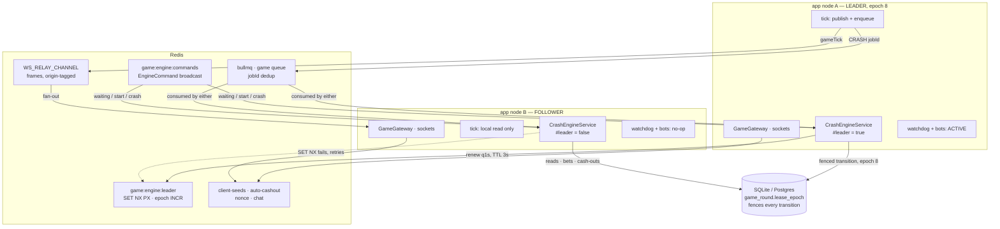

# 06 — Scaling past one replica

Design and analysis only, by decision. Nothing in this document is implemented.
Every claim carries `file:line` from `refactor/architecture-sweep` @ `8869a82`.

## Executive summary

1. **Yes to the Redis lease, but it is not the blocker.** A `SET key token NX PX ttl`
   lease is the right primitive for electing the one process allowed to hold the
   clock, and `RedisConnection.set` already takes `nx`/`px`
   (`apps/be/node_modules/@dunx/infra/dist/redis/connection.d.ts:26-27,67`).
2. **The blocker is one SQLite file on local disk.** `SQLITE_DB_PATH` is a path
   (`apps/be/src/config/dto/db-vars.dto.ts:10`), bind-mounted from one Docker volume
   (`docker-compose.prod.yml:86-87`). A second replica on a second host cannot open
   it, and no Redis lock changes that. "More than one replica" therefore splits into
   three different asks with three different prices — see Step 2.
3. **The premise is incomplete in a second way too:** what the old
   `pg_try_advisory_xact_lock` protected was the *bet path*, and that is already
   protected without any lock (guarded debit + unique index +
   non-yielding `transactionSync`, `apps/be/src/game/services/game-bet.service.ts:36-59`).
   The lease is for the *game loop*, not the ledger. Two engines cost duplicate
   rounds and duplicate frames, **not** duplicate money.
4. **Most of the cross-process machinery already exists.** The websocket relay, the
   `EngineCommand` channel, the client-seed pool, the auto-cashout claim, the nonce,
   the chat scrollback and BullMQ are all already multi-node correct. What is
   single-node is the clock, the schedules, and two un-deduplicated enqueues.
5. **Recommendation: Stage 0 now (three real bugs, no leadership needed), Stage 1
   designed and shipped at one replica, Stage 2 only if a host failure is in the risk
   model, and do not replace SQLite without a business reason** — the single-replica
   constraint costs about one round per deploy.

---

## Step 1 — Every single-node assumption, with evidence

### 1.1 What is genuinely single-node

| # | Assumption | Evidence | Blast radius with 2 replicas |
|---|---|---|---|
| A | The tick loop must run in exactly one process | `game/engine/crash-engine.service.ts:47-69,178-186,294-333` | Duplicate `gameTick` frames; duplicate crash enqueues (deduplicated, see 1.3) |
| B | `game.round.schedule` is enqueued with **no `jobId`** | `game/engine/crash-engine.service.ts:208`; `game/services/game-watchdog.service.ts:120` | **Two rounds created.** The worst of the set |
| C | Engine in-memory state is read on the **request** path | `game/game.gateway.ts:296,303,386,391-393`; `game/services/game-state.service.ts:23-45,25,44` | A follower serves `roundId: null` and refuses every cash-out |
| D | Schedules are in-process, single-node, and unconditional | `infra/schedule/schedule.module.ts:23-25`; upstream says so outright: `apps/be/node_modules/@dunx/infra/dist/schedule/module.d.ts:6-10` | Every replica runs every schedule |
| E | The stuck-round sweep writes directly, "which it can now there is one process" | `game/services/game-watchdog.service.ts:28-29,65-125` | N sweeps racing on the same rows |
| F | `InvitesService.expireStale` `@hourly` | `invites/services/invites.service.ts:167-172` | Harmless (idempotent `UPDATE`), but N× the writes |
| G | `GameBotsService.watch` polls the engine every 250 ms | `game/bots/game-bots.service.ts:19,128-151` | N× the cosmetic bet frames — a lobby showing each bot N times |
| H | `subscriberCount` is per-node and the code says so | `game/game.gateway.ts:631-648`; `apps/be/node_modules/@dunx/http/dist/ws/pubsub.d.ts:41` | Player count under-reports by a factor of N |
| I | One SQLite file, local disk | `infra/db/database.module.ts:63-91`; `config/dto/db-vars.dto.ts:10`; `apps/be/Dockerfile:44-52` | **Nothing works across hosts.** See Step 2 |
| J | Migrations run in the constructor, on every boot | `infra/db/database.module.ts:27-37` | Already N processes today (each BullMQ fork boots `JobsModule`, `app.module.ts:150-161`), so WAL + `busy_timeout` already cover it |
| K | `AuthAdminSeeder` writes at `onInit` | `auth/services/auth-admin.seeder.ts:32-52` | Non-prod only (`:33`), and idempotent by the existence check (`:36-45`) |

The two entries that matter most are **B** and **C**.

**B** is a live bug at one replica, not a multi-replica one. Compare the three
enqueue sites: `START` gets `jobId: game-round-start-${round.id}`
(`crash-engine.service.ts:221`, `handlers/game.jobs.ts:77`), `CRASH` gets
`jobId: game-round-crash-${roundId}` (`crash-engine.service.ts:321`), and
`SCHEDULE` gets nothing at all (`crash-engine.service.ts:208`,
`game-watchdog.service.ts:120`). Two processes reaching `#recover()` with no live
round create two rounds. `findCurrentRound()` returns the newest by `createdAt`
(`repos/game-round.repository.ts:45-57`), so the other is orphaned with whatever bets
landed on it, until the watchdog fails and refunds it up to
`GAME_STUCK_ROUND_THRESHOLD_MS` later — 180 s by default
(`config/dto/game-vars.dto.ts:35-39`).

**C** is the reason "just scale the stateless parts" is harder than it sounds.
`GameGateway.#cashOut` reads `this.engine.currentMultiplierX100()` synchronously
(`game.gateway.ts:391`) precisely so the player is paid the number that was on their
screen (`game.gateway.ts:366-371`, `services/game-bet.service.ts:175-182`). On a
replica with no engine state that read returns `null` and the player is told
"Round is not currently running" (`game.gateway.ts:393-395`). The clock is on the
request path, not only the tick path.

### 1.2 What already works across processes — confirmed

| Mechanism | Evidence | Verdict |
|---|---|---|
| **Websocket fan-out** | `http.options.ts:42-53` configures `RedisRelay` **unconditionally**; `apps/be/node_modules/@dunx/http/dist/ws/pubsub.d.ts:24-40`; frames carry an `origin` so the publisher does not double-deliver, `.../ws/relay.d.ts:70-83` | **Already N-node.** `SocketPublisher.publish` → `PubSub.publishEvent` → relay → every other node (`notifications/events/events.publisher.ts:48-58`) |
| **The relay's other direction** | `RelayPublisher` puts frames on the same channel from a process with no server (`notifications/events/events.publisher.ts:74-91`) | Already exercised in production by every sandboxed job child (`app.module.ts:155`) |
| **`EngineCommand`** | Published on `game:engine:commands` (`handlers/game.jobs.ts:161-173`), subscribed by every engine instance (`engine/crash-engine.service.ts:262-292`) | **Already generalises.** Redis pub/sub delivers to all subscribers, so N engines all receive `waiting`/`start`/`crash`. It is a broadcast, not a point-to-point call — which is exactly what a shadow clock needs |
| **BullMQ** | `QueueModule.forRootAsync({ consume, prefix, ... })` (`infra/queue/queue.module.ts:40-79`) | **Multi-consumer safe by construction.** N replicas consuming one queue is BullMQ's normal mode. `jobId` deduplicates, and round transitions are idempotent because the `from` status is in the `WHERE` (`repos/game-round.repository.ts:116-135`) |
| **Client-seed pool** | `game:client-seeds:${roundId}` in Redis, `HSETNX`/`hset` (`services/game-round.service.ts:31-33`; `game.gateway.ts:318-326,495`), read at draw time and deleted only *after* the draw (`handlers/game.jobs.ts:99-103`) | Shared. A failover between commit and draw reproduces the same crash point |
| **Auto-cashout** | `game:auto-cashout:${roundId}`, claimed with `hdel` **before** the payout (`services/auto-cashout.service.ts:80-84`) | Already a cross-process claim. `hdel` returning 0 means someone else got it |
| **Round nonce** | one `INCR` on `game:round:nonce` (`services/game-round.service.ts:16-17,102-105`) | Shared and monotonic |
| **Chat scrollback** | capped list at `chat:global:history` (`chat/services/chat.service.ts:12,51-88`) | **Confirmed shared.** Any node serves any client's scrollback |
| **Rate limiting** | one Redis key per caller and route (`infra/redis/guards/throttle.guard.ts:16-33,52`) | Shared, fails open |
| **Better Auth sessions** | database by default, Redis `secondaryStorage` as an explicit opt-in (`auth/auth.module.ts:50-51,116`; `auth/schema/session.schema.ts:5-12`) | **Shared either way** — but note *which* shared store: on one host both paths work; across hosts the database path dies with SQLite and `AUTH_SESSION_STORE=redis` becomes mandatory, not optional |

### 1.3 Split-brain, walked through concretely

Two engines, both believing they own round R. What actually happens:

- **Ticks.** Both publish `gameTick` (`engine/crash-engine.service.ts:329-332`). Both
  compute from `GameMath.multiplierAtX100(Date.now() - startedAt, divisor)`
  (`:296-302`), which is a **pure function of `startedAt`** (`game.math.ts:42`) and
  `startedAt` comes from one row. So the two values differ by at most the clock skew
  between the nodes, not by a whole timeline. The visible symptom is a stutter of a
  few hundredths and a doubled frame rate — unpleasant, not incoherent. The
  "two timelines" framing in `crash-engine.service.ts:52-55` is worse than the
  reality, because the curve is deterministic.
- **Crash.** Both enqueue with `jobId: game-round-crash-${roundId}`
  (`:318-322`) → BullMQ deduplicates → one `settleCrash`, one reveal.
- **Round creation.** Both enqueue `SCHEDULE` with no `jobId` → **two rounds**. This is
  the one that hurts, and it is item B above.
- **Ledger.** No double-spend is reachable. The debit is guarded in SQL
  (`repos/wallet.repository.ts:75-95`), `game_bet_round_user_demo_index` is unique
  (`services/game-bet.service.ts:51-54,69-75`), a second `cashOut` finds no ACTIVE
  bet (`services/game-bet.service.ts:193-207`), and the auto-cashout claim is atomic
  (`services/auto-cashout.service.ts:83-84`).

**Is it recoverable?** Yes, and by paths that already exist: the orphan round is
failed and refunded by `GameRoundWatchdog.sweep`, which explicitly handles
"more than one RUNNING round" and keeps the newest (`game-watchdog.service.ts:127-148`).
A player's stake is stranded for up to 180 s and then returned. **What the ledger
shows** afterwards is a `REFUND` transaction (`services/game-bet.service.ts:254-262`)
and a `FAILED` round — auditable, correct, and embarrassing.

That is the honest reframe of the user's question: **the lease protects the game
loop's coherence, not the money.** The money is already protected.

---

## Step 2 — The storage question, head on

"More than one replica" is three different asks.

### (a) N replicas of `app` on the same host, sharing the file

**What it buys.** Zero-downtime deploys (blue/green against one volume) and real
parallelism for HTTP, the client bundle, and socket fan-out. Nothing else.

**What it costs.** The Step 3 work, and nothing in the data layer: the pragmas in
`infra/db/database.module.ts:63-91` are already the N-writer design, and the app
*already runs N writers* — the parent plus one BullMQ fork per burst
(`infra/queue/queue.module.ts:20-31`, `jobs.processor.ts:21-40`,
`apps/be/Dockerfile:44-46`).

**What breaks.** Nothing new in storage. One caveat worth writing down: this only
holds for a **local** filesystem. Two containers sharing one Docker volume is fine;
two containers sharing an NFS/EFS mount is not — SQLite's POSIX advisory locking is
unreliable over network filesystems and the failure mode is silent corruption, not
`SQLITE_BUSY`. If the volume ever moves off local disk, option (a) evaporates.

**Assessment: cheapest, buys the thing most likely actually wanted (deploys).**
It does not survive a host failure, a disk failure, or a kernel panic.

### (b) N replicas across hosts — requires replacing SQLite

There is no version of this that keeps `bun:sqlite`. The file is the boundary.

Before evaluating candidates, be precise about what is at stake, because the usual
framing ("async breaks the atomic bet") is half right and the half that is wrong
matters.

**What `transactionSync` actually buys.** Three things replace the old advisory lock
(`services/game-bet.service.ts:36-59`):

1. `transactionSync` cannot yield — its callback's return type refuses a promise, so
   read-check-write is one JS turn (`:45-49`).
2. The debit is guarded in SQL: `WHERE balance_cents >= ?`
   (`repos/wallet.repository.ts:83-95`).
3. `game_bet_round_user_demo_index` is unique (`:51-54`).

(2) and (3) are **database-level** guarantees and survive any driver. They already
hold "even against the other process" (`repos/wallet.repository.ts:78-81`) — which is
the same thing as holding against another host. So an async driver does **not** open
an overdraft and does **not** open a double bet.

What (1) buys that the others do not is narrower and worth naming exactly: it is a
**compile-time** guarantee that nobody can introduce an `await` into the middle of a
bet. Not a runtime one. Under Postgres the runtime guarantee is *stronger* — a real
transaction with `SELECT ... FOR UPDATE` or `SERIALIZABLE` holds across hosts, which
`transactionSync` never did — and the compile-time guarantee is gone. **Replacing a
compiler-enforced invariant with a convention is the real, money-relevant cost**,
and the correct compensation is a test that asserts the invariant, not a comment
asking people to remember it. Any (b) migration that does not ship that test first
is the dangerous version of this change.

Also lost or rewritten under (b), none of it optional:

- `AuditTriggers` — hand-written SQLite trigger SQL, including the
  `_audit_ctx` single-row actor table (`infra/db/triggers.ts:18-91`).
- Error matching on `SQLiteError` / `SQLITE_CONSTRAINT_UNIQUE`
  (`services/game-bet.service.ts:1,69-75`) → `23505`.
- `SyncDatabase`, `transactionSync`, `Tx.asHandle` and every `static over(handle)`
  (`infra/db/tx.ts:13-36`) — the whole repository idiom.
- Every synchronous repository call becomes `await`, which reaches the gateway
  handlers and `GameStateService.snapshot()` (`services/game-state.service.ts:23`).
- Migrations regenerate; `DatabaseBootstrap`'s constructor-time `migrate()` becomes a
  boot phase with a lock (`infra/db/database.module.ts:27-37`).

**Candidates.**

| Candidate | Keeps drizzle sqlite-core? | Sync? | Verdict |
|---|---|---|---|
| **Postgres** | No (`pg-core`) | No | **The only serious answer.** Where the app came from, so the shape is known. Interactive transactions, row locks, real `FOR UPDATE`, `LISTEN/NOTIFY` if `EngineCommand` ever wanted a second transport. Cost: the full list above |
| **libSQL / Turso** | Yes — dialect, schema, migrations and triggers survive | No | Buys dialect continuity, costs the same synchrony *plus latency*. A network round trip inside a path that runs under a 100 ms tick (`config/dto/game-vars.dto.ts:18`) is a real regression against `bun:sqlite`'s in-process reads. Embedded replicas make reads fast and writes still go to the primary — and this app's hot path is a *write*. Sensible only if geo-distributed reads become the driver, which they are not |
| **Cloudflare D1** | Yes | No | **Reject.** `cloudflared` in `docker-compose.prod.yml:19-32` is a *tunnel* — how the app is reached — and implies nothing about D1 being appropriate. D1 from a long-lived Bun process is an HTTP API with per-request limits and no interactive transactions; settling a round's bets is the workload it is worst at. (The Cloudflare product that actually matches this app's shape — one authoritative single-threaded instance per key — is Durable Objects, and that is a rewrite, not a migration.) |

**Assessment: (b) is a data-layer rewrite. Price it as one.** It buys survival of a
host failure. Nothing else on this list needs it.

### (c) Scale only the stateless parts, engine stays singleton

This is the option that sounds free and is not, for two reasons.

First, **there is no stateless part.** Every node takes bets, so every node writes.
`GameGateway` is a write path (`game.gateway.ts:270-364,372-458`). So (c) still has
to pick (a) or (b) underneath — it is a *topology* answer, not a storage answer.

Second, item **C** above: the engine's in-memory clock is read on the request path,
so a follower cannot serve `roundState` or a cash-out today. Two ways out:

- **Route cash-outs to the leader.** Needs sticky routing or an internal hop, and
  `cloudflared` gives neither for free. Rejected.
- **Every node runs the clock read-only.** Feasible *today*, with no new plumbing:
  `startedAt` and `crashPointX100` are both in the row
  (`services/game-round.service.ts:165-171`), `#recover()` already rebuilds engine
  state from that row (`engine/crash-engine.service.ts:203-255`), and
  `EngineCommand` already broadcasts every transition to every subscriber
  (`handlers/game.jobs.ts:161-173` → `engine/crash-engine.service.ts:262-292`).

The second is the design. **Every node ticks; exactly one node is allowed to
publish and enqueue.** That is a small change to `CrashEngineService`: a `#leader`
flag gating the two side effects in `#onTick` — the `#enqueue` at `:318-322` and the
`GameEvents.publish` at `:329-332` — plus the auto-cashout callback at `:326-327`.
The local read paths (`currentMultiplierX100`, `phase`, `roundId`) stay live on
every node, which is what makes a follower able to serve a cash-out at all.

**Assessment: (c) as stated is not an option; (c) rewritten as "shadow clock on
every node, leader-only side effects" is the right architecture, and it needs (a) or
(b) underneath regardless.**

---

## Step 3 — The Redis lease, designed

### 3.1 Keys and operations

```
game:engine:leader   string  "<nodeId>:<epoch>"   PX = GAME_LEASE_TTL_MS
game:engine:epoch    int     monotonic fencing token, INCR-only
```

**Acquisition.** One `EVAL`, because `SET NX` and `INCR` must not be separable — two
round trips would let a crash between them mint an epoch nobody holds, or worse,
hand two acquirers one epoch:

```lua
-- KEYS[1] leader  KEYS[2] epoch   ARGV[1] nodeId  ARGV[2] ttlMs
if redis.call('SET', KEYS[1], ARGV[1], 'NX', 'PX', ARGV[2]) then
  local e = redis.call('INCR', KEYS[2])
  redis.call('SET', KEYS[1], ARGV[1] .. ':' .. e, 'PX', ARGV[2])
  return e
end
return nil
```

`RedisConnection.send('EVAL', [...])` is the escape hatch
(`apps/be/node_modules/@dunx/infra/dist/redis/connection.d.ts:140-146`); the plain
`set(key, value, { nx, px })` form is also typed (`:14-31,67`) and is what a
non-fenced acquisition would use.

**Renewal.** Compare-and-`PEXPIRE`, never a bare `PEXPIRE` — a bare one extends a
lease somebody else now holds:

```lua
if redis.call('GET', KEYS[1]) == ARGV[1] then return redis.call('PEXPIRE', KEYS[1], ARGV[2]) end
return 0
```

**Release.** Compare-and-`DEL`, same reason. Called from `onShutdown`
(`engine/crash-engine.service.ts:102-104`) so a deliberate deploy hands leadership
over in milliseconds instead of waiting out a TTL.

**Cadence vs TTL.** Renew at `ttl / 3`. Suggested `GAME_LEASE_TTL_MS = 3000`,
renewal every 1000 ms: two consecutive renewal failures before expiry, so a single
Redis hiccup does not trigger a failover. **Do not set the TTL below the p99
event-loop stall.** The renewal must run on the *same* loop as the tick — which is
free, since the tick is a `ScheduleRegistry` entry on this loop
(`engine/crash-engine.service.ts:178-186`) — so a stall stops both renewing and
ticking. That is the property worth having: a stalled leader goes quiet rather than
going rogue.

The renewal cannot be a `@Interval` decorator for the same reason the tick is not:
`GAME_LEASE_TTL_MS` is validated config and a decorator argument is evaluated before
the container exists (`infra/schedule/schedule.module.ts:13-25`,
`config/dto/game-vars.dto.ts:12-18`). It is a `ScheduleRegistry.add()` with a fixed
name, armed at `onInit` and never re-armed, exactly like
`GameRoundWatchdog.SCHEDULE` (`services/game-watchdog.service.ts:36-62`).

### 3.2 Fencing tokens, and the limit Redis cannot cross

**Be blunt about this: Redis alone cannot give a safe fence.** A lease is a promise
about time, and a process that is paused — GC, a VM suspend, a slow fsync, a
container throttled by the cgroup — resumes believing it still holds a lease that
expired while it was frozen. This is Kleppmann's standing objection to using a
lock service (Redlock included) as if it were a mutex: mutual exclusion cannot be
established by the lock service alone, because the lock service is not the thing
being written to. The fence has to be **checked by the resource**. Redis issues the
token; the storage layer has to enforce it.

So the epoch has to be checked at three places, and each has a different honesty
level:

**1. Every round mutation — enforceable, and cheaply.**
Add `lease_epoch INTEGER NOT NULL DEFAULT 0` to `game_round`
(`game/schema/game-round.schema.ts`). `GameRoundRepository.transition` already puts
the expected status in the `WHERE` and returns `undefined` when it loses
(`repos/game-round.repository.ts:116-135`); add `AND lease_epoch <= ?` and
`SET lease_epoch = ?`. An old leader at epoch 7 transitioning a round the new leader
stamped at epoch 8 updates zero rows and gets `undefined` — **which every caller
already treats as "somebody else did it"**
(`services/game-round.service.ts:173-178`, `handlers/game.jobs.ts:94-97,131-133`).
The control flow for a fenced write already exists. This is one predicate, not a new
mechanism, and it is the single most important line in this document.

**2. Every enqueue — partly enforceable, and mostly already covered.**
Carry `epoch` in the `RoundJob` payload (`game.events.ts:60-62`) and have each
handler drop a job whose epoch is below the current one. Note what this does *not*
have to catch: a delayed `START` from a deposed leader is already deduplicated by
`jobId: game-round-start-${round.id}` (`engine/crash-engine.service.ts:221`,
`handlers/game.jobs.ts:71-79`), and its DB write is fenced by (1) anyway. The epoch
in the payload is worth carrying mainly for the log line that explains an
otherwise-silent no-op.

**3. Every socket frame — not enforceable. Say so.**
A frame is not a transaction. A frozen-then-resumed leader will fire one tick,
publish it through the relay to every browser, and only *then* fail to write
anything. There is no fence on a `gameTick`. The mitigation is to make the window
small, not to pretend it closes: the renewal handler sets `#leader = false`
**synchronously** on a failed renewal, which disarms publishing on the very next
tick. That covers the common case — Redis said no. It does not cover the
pathological case — the process was not running to be told. The residual exposure is
bounded by the renewal interval, and the symptom is a duplicated frame with a
near-identical multiplier (see 1.3), not a wrong outcome.

**The fence is authoritative for money and best-effort for pixels.** That asymmetry
is not a compromise; it is the correct place to draw the line.

### 3.3 Losing the lease mid-round, with bets placed and the multiplier climbing

Round R is RUNNING. Crash point 384 (`3.84x`, integer hundredths per
`engine/crash-engine.service.ts:29-37`). Bets are open. Leader A holds epoch 7. At
`T0 + 2s` A's lease expires. B acquires at `T0 + 2.05s`, epoch 8.

**Does the round crash, void, or continue?**

**It continues, and it must.** Everything B needs is already in the row: the crash
point was drawn and committed at the transition to RUNNING
(`services/game-round.service.ts:158-171`), as was `startedAt`. `#recover()` already
does exactly the right thing with it (`engine/crash-engine.service.ts:203-255`):
recompute the multiplier from `startedAt`, and either crash immediately if the curve
has already passed the crash point (`:237-249`) or resume ticking (`:251-253`).
**The recovery path is already the failover path.** No new state transfer is needed —
only the election.

Voiding would be the wrong answer *and a fairness violation*: the outcome is already
determined and its commitment already published, so refunding on an infrastructure
event is operationally indistinguishable from cancelling rounds the house dislikes.
**A round with a drawn crash point is never voided by a leadership change.** A new
implementation must not "clean up the old leader's round" on acquisition. The
watchdog's `failAndRefund` is threshold-driven at 180 s
(`config/dto/game-vars.dto.ts:35-39`) and therefore already unreachable from a
sub-second failover — keep it that way.

**Who publishes the server seed?** The `crash` **job** does
(`handlers/game.jobs.ts:126-159`), and it is a queue job — so whichever node consumes
it publishes the reveal. **The fairness reveal does not depend on leadership at
all**, and it is already multi-consumer safe. Nothing to change.

**What is actually lost in the gap.** Two things, and one of them is money.

- *Ticks.* ~2 s with no `gameTick`. The client's next frame jumps. Cosmetic.
- *Auto-cashouts.* The sweep is driven by the tick
  (`engine/crash-engine.service.ts:326-327` → `game.gateway.ts:126-137`), so nothing
  fires during the gap. **If the round is still running when B resumes, nobody
  loses:** the payout is `Math.min(current, target)`
  (`services/auto-cashout.service.ts:86`), so a player whose 2.00x target was crossed
  during the gap is still paid 2.00x. The `min` is what makes a gap non-lossy.
  **If the crash point falls inside the gap, that player loses a bet they should
  have won** — `#recover` enqueues `CRASH` immediately (`:243-248`) and
  `settleAllBetsAsLost` closes every open bet
  (`services/game-round.service.ts:196-208`), auto-cashout entries included.

That last one is a real money bug and it **exists today**: any restart mid-round has
the identical shape. Failover only makes it routine. The repair belongs in this
design and also stands alone: **before a recovery-crash, sweep the auto-cashout hash
at `min(crashPoint, target)` for every entry whose target is at or below the crash
point.** Everything needed is already there — the hash survives the process
(`services/auto-cashout.service.ts:20-30,47-56`), the claim is atomic (`:83-84`), and
`GameBetService.cashOut` takes the multiplier as a parameter
(`services/game-bet.service.ts:183-188`).

### 3.4 Fencing the schedules

A schedule that fires on a non-leader must no-op. Four of them, and they do not all
want the same rule:

| Schedule | Rule | Why |
|---|---|---|
| `game.round.tick` (`engine/crash-engine.service.ts:85,178-186`) | **Follows the lease.** Stays armed on every node for the *local read* (item C), but `#onTick`'s publish and enqueue are gated on `#leader` | A follower needs a live clock to serve a cash-out; it must not broadcast or enqueue |
| `game.round.watchdog` (`services/game-watchdog.service.ts:37,49-62`) | **Leader only.** First line of `sweep()` returns `{ failed: 0 }` when not leader | It writes directly (`:28-29`) and enqueues a loop restart (`:120`) |
| `GameBotsService.watch` (`bots/game-bots.service.ts:128`) | **Leader only.** One more condition beside `#enabled` at `:130` | Cosmetic frames N× over is the whole visible bug |
| `InvitesService.expireStale` (`invites/services/invites.service.ts:167`) | **Leave it.** Idempotent bookkeeping, and `accept()` enforces expiry on `expiresAt` rather than on this column (`:156-166`) | Gating it would add a Redis dependency to a path that needs none |

The tick is per-round and is armed inside `startRunning`
(`engine/crash-engine.service.ts:170-188`), so it already follows the round rather
than the process — which means "follows the lease" costs nothing structurally. Note
the existing disarm-before-arm at `:175-177`: the registry refuses a duplicate name
(`apps/be/node_modules/@dunx/infra/dist/schedule/registry.d.ts:40-45`), so a repeated
`start` command must clear first. A leadership change delivers `start` again on the
pub/sub path, so that guard is load-bearing for failover too.

### 3.5 The fairness guarantee across a failover

The window that matters is between step 1 and step 3 of the round order: the
commitment is published when the round is *created*
(`services/game-round.service.ts:111-136`, broadcast at `handlers/game.jobs.ts:57-67`)
and the crash point is drawn only at the transition to RUNNING (`:145-186`). Default
`GAME_WAITING_PHASE_MS` is 10 s (`config/dto/game-vars.dto.ts:14`), so a failover
lands in that window about a third of the time.

**Nothing about fairness changes, and it is worth being precise about why.** The
draw is a pure function of the seed, the combined client seeds and the nonce
(`game.math.ts:85-92`), the seed is in the row, and the client-seed set is in Redis
and is deleted only *after* the draw (`handlers/game.jobs.ts:99-103`). So the new
leader draws **the same number** the old one would have. The failover is invisible in
the verification a player runs (`services/game-round.service.ts:262-283`).

Two things do need saying:

1. **The draw is not leader-gated today and does not need to be.** `start` is a job
   (`handlers/game.jobs.ts:89-120`), any consumer may run it, and the
   `WHERE status = WAITING` transition means one wins
   (`repos/game-round.repository.ts:124-135`). The loser has already *computed* a
   crash point and discards it — the same number, never published. Not an attack,
   since every node is in one trust domain, but it does mean the crash point's
   confidentiality boundary is "any process holding the database", not "the leader".
   Write that down before someone assumes otherwise.
2. **A failover must never be able to redraw.** With `lease_epoch` added, the fenced
   transition is what guarantees this: once epoch 8 has stamped the round RUNNING
   with a crash point, epoch 7's transition updates zero rows and its computed crash
   point dies with the `undefined` (`services/game-round.service.ts:173-178`). Without
   the fence, `status = WAITING` alone already gives it. The fence makes it hold under
   a resumed-from-frozen leader too.

### 3.6 Proposed topology



The two edges that carry the design: `C` reaching **both** engines is what makes a
follower's clock live enough to serve a cash-out, and the `lease_epoch` predicate on
`D` is what makes the lease safe rather than merely probable.

---

## Step 4 — Recommendation

### Option 0 — Do nothing, and what it actually costs

The only downtime today is deploy. Add it up from the deployed config:
`HEALTH_DRAIN_DELAY_MS: 6000` (`docker-compose.prod.yml:74-80`), then
`server.stop()`, then teardown, inside `stop_grace_period: 20s` (`:81-83`) — the
ordering being the point of `Readiness` implementing `OnBeforeShutdown`
(`infra/health/health.module.ts:31-36`, `main.ts:81-92`). Then image start,
`DatabaseBootstrap`'s migrations (`infra/db/database.module.ts:27-37`), and
`#recover()`. Call it **10–30 s of no HTTP and every socket dropped**.

What a player loses: **about one round.** The betting window is 10 s and the
cool-down 5 s (`config/dto/game-vars.dto.ts:14-16`), and `#recover` does the right
thing on either side of the crash point (`engine/crash-engine.service.ts:230-253`) —
a round that should have crashed is crashed rather than resumed, so nobody is paid
for a bet that lost. The client reconnects on its own
(`apps/fe/src/systems/network/socket.ts:35-44`).

What Option 0 does **not** cover: a host failure, a disk failure, or an OOM. Those
are an outage until Docker's `restart: unless-stopped` (`docker-compose.prod.yml:64`)
brings it back, and a lost volume is a lost ledger.

**Option 0 is defensible.** For a game whose entire state recovers from one table
in under a second, a few seconds of dropped sockets a few times a week is a real but
small cost. It should be chosen deliberately, not by default.

### The staged path

**Stage 0 — now, no leadership involved, three real bugs.** Every one of these is a
single-replica correctness fix *and* a prerequisite for anything later.

1. Give `game.round.schedule` a deterministic `jobId` at both enqueue sites
   (`engine/crash-engine.service.ts:208`, `services/game-watchdog.service.ts:120`).
   Two boots must not mean two rounds. Mind the trap already documented at
   `services/game-watchdog.service.ts:21-26`: a just-completed job with that id is
   still in the completed set, so the id must vary per round
   (`game-round-schedule-after-${roundId}` is the existing shape,
   `handlers/game.jobs.ts:154`) rather than being a constant.
2. Sweep auto-cashouts before a recovery-crash (§3.3). Today a restart mid-round
   loses a winning auto-cashout.
3. Fix the two prefixes CLAUDE.md already says must name this app and which still
   do not: `WS_RELAY_CHANNEL` defaults to `dunx-template:ws`
   (`config/dto/redis-vars.dto.ts:82`) and `THROTTLE_PREFIX` to `dunx-template`
   (`:34`). While there, namespace `GAME_ENGINE_CHANNEL`
   (`engine/crash-engine.service.ts:19`) — it is a bare `game:engine:commands`, so two
   deployments on one Redis command each other's clocks.

**Stage 1 — the lease, shipped at one replica.** Everything in Step 3: the lease and
epoch, `lease_epoch` on `game_round` with the fenced `transition`, the engine split
into shadow-clock plus leader-only side effects, the four schedule rules. Ship it
**with `replicas: 1`**. It changes nothing observable at one replica — the single
node simply always wins the election — so it gets exercised in production before
anything depends on it. Then blue/green becomes possible on one host: the new
container boots as a follower, the old one releases on `onShutdown`, and the failover
is the `#recover` path that already runs on every deploy.

**Stage 2 — two replicas, same host, same volume.** Zero-downtime deploys and
parallel socket fan-out. Fix `subscriberCount` first or accept that the player count
under-reports (`game.gateway.ts:631-648`) — a Redis `SCARD` of connected socket ids,
or simply publish per-node counts and sum them. **Stop here** unless host failure is
genuinely in the risk model.

**Stage 3 — Postgres, only with a business reason.** Priced as a data-layer rewrite
per §Step 2(b), and gated on the bet-path test suite landing *first*, because that
suite is what replaces the compile-time guarantee `transactionSync` currently gives
for free.

### The recommendation

**Do Stage 0 now.** It fixes bugs that exist at one replica.

**Design Stage 1 now, implement it when deploy downtime becomes a complaint.** The
lease is the right primitive, the fence is cheap because
`GameRoundRepository.transition` already has the shape, and the failover logic is
already written — it is `#recover`.

**Do not do Stage 3 on the strength of "we should be able to scale".** The
single-replica constraint costs about one round per deploy; multi-host costs the
synchronous data layer, the audit triggers, and a compiler-enforced invariant on the
money path. That trade only makes sense when surviving a host failure is worth
something concrete.

And to answer the question as asked, in one line: **we can lock to Redis, and we
should — but the lock buys a coherent game loop, not a second replica. The second
replica is bought from the storage layer, and today that is one file on one disk.**

---

## Risk register

| # | Risk | Likelihood | Impact | Mitigation | Evidence |
|---|---|---|---|---|---|
| R1 | Two rounds created by a duplicate boot or a split-brain | **High** — no `jobId` at all | Player stakes stranded up to 180 s, then refunded | Stage 0.1: deterministic `jobId` | `engine/crash-engine.service.ts:208`; `services/game-watchdog.service.ts:120`; `config/dto/game-vars.dto.ts:35-39` |
| R2 | Winning auto-cashout lost when the crash falls inside a restart/failover gap | **Medium** today, high once failover is routine | **Real money.** Player loses a bet they won | Stage 0.2: sweep before the recovery-crash | `engine/crash-engine.service.ts:237-249`; `services/auto-cashout.service.ts:86`; `services/game-round.service.ts:196-208` |
| R3 | Frozen-then-resumed leader publishes a stale tick | Low, unavoidable | Cosmetic — duplicated frame, near-identical value | Synchronous `#leader = false` on renewal failure; accept the residual and bound it by the renewal interval | §3.2; `game.math.ts:42`; `engine/crash-engine.service.ts:296-302` |
| R4 | A resumed old leader writes a round transition | Low | Would be severe without a fence | `lease_epoch` predicate in `transition`; callers already handle `undefined` | `repos/game-round.repository.ts:116-135`; `services/game-round.service.ts:173-178` |
| R5 | Lease TTL set below the p99 event-loop stall | Medium if untuned | Failover storms — leadership flapping every few seconds | TTL ≥ 3× renewal interval; renew on the same loop as the tick; alert on epoch rate | §3.1 |
| R6 | Two deployments share one Redis and cross-command each other | Medium — defaults still say `dunx-template` | Clocks and rate limits from another app | Stage 0.3 | `config/dto/redis-vars.dto.ts:34,82`; `engine/crash-engine.service.ts:19` |
| R7 | The SQLite volume moves to a network filesystem | Low, but silent | Corruption, not `SQLITE_BUSY` | Assert a local mount; option (a) is void otherwise | `infra/db/database.module.ts:63-91`; `docker-compose.prod.yml:86-87` |
| R8 | An `await` slips into the bet path after a Postgres migration | Medium, and the reason (b) is expensive | Overdraft is still blocked by SQL; a double bet is still blocked by the index; a *reordered* read-check-write is not | Ship the bet-path test **before** the driver change | `services/game-bet.service.ts:36-59,110-173`; `repos/wallet.repository.ts:75-95` |
| R9 | Follower cannot serve a cash-out | Certain, if the engine is not split | Every cash-out on N-1 nodes refused | Shadow clock on every node; leader-only side effects | `game.gateway.ts:386-395`; `services/game-state.service.ts:23-45` |
| R10 | Player count wrong at N>1 | Certain | Cosmetic, and already documented in the code | Sum per-node counts, or a Redis set | `game.gateway.ts:631-648`; `apps/be/node_modules/@dunx/http/dist/ws/pubsub.d.ts:41` |
| R11 | A leadership change is used, deliberately or by accident, to void a drawn round | Low | **Fairness break** — indistinguishable from cancelling unfavourable outcomes | Written rule: a round with a drawn crash point is never voided by a leadership change; keep `failAndRefund` threshold-driven | §3.3; `services/game-round.service.ts:210-238`; `config/dto/game-vars.dto.ts:35-39` |
